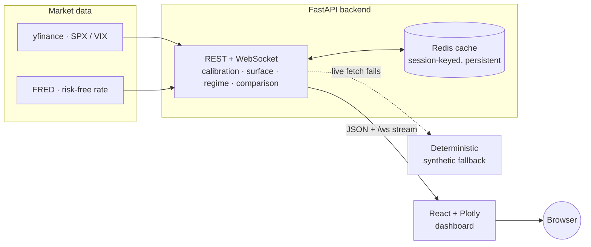
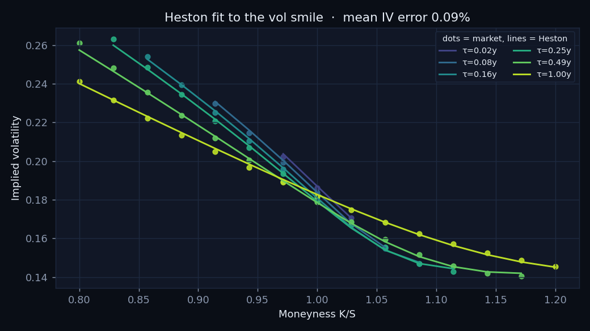
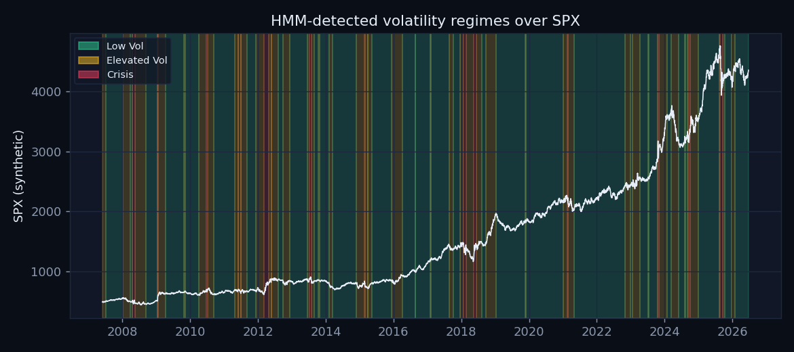
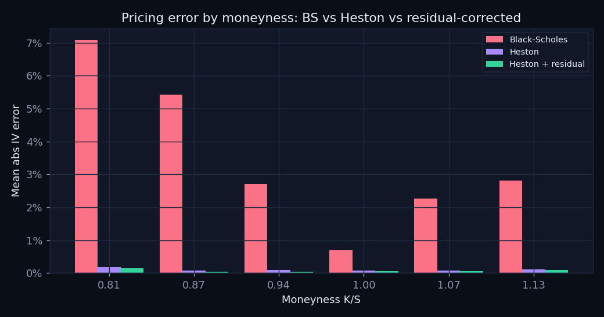
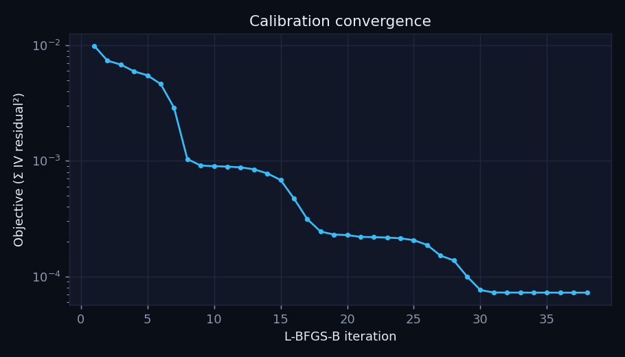

# heston-regime-lab

[](https://github.com/austxu/heston-regime-lab/actions/workflows/ci.yml)
[](https://github.com/austxu/heston-regime-lab/actions/workflows/deploy.yml)


Stochastic-volatility research lab: calibrate the **Heston** model to SPX options, detect
market **regimes** with a hidden Markov model, and study how Heston parameters and
calibration error change across regimes — served as a live API with a React dashboard.

**🔗 Live demo:** _set after the first Railway deploy_ — see [DEPLOY.md](DEPLOY.md) · **API docs:** `/docs` on the deployed API

> **Status: Phase 4 / 4 — deployed.** Math core, FastAPI backend, and React dashboard are
> complete; CI/CD (GitHub Actions → Railway), production hardening (rate limiting, gzip,
> JSON logging, Sentry), and deployment config are in place.

## Architecture



Data flows **yfinance/FRED → FastAPI → Redis → React**, with a deterministic synthetic
fallback at the data layer so every component runs offline.

## Phases
1. **Math core ✅:** Heston characteristic function, Gil-Pelaez Fourier inversion with
   Gauss-Legendre quadrature, Black-Scholes baseline + implied-vol inversion, L-BFGS-B
   calibration, synthetic round-trip validation (recover ground-truth params within 1%).
2. **Backend + API ✅:** yfinance/FRED data layer with a deterministic synthetic fallback,
   vol features, 3-state Gaussian HMM regimes, XGBoost residual correction, Kruskal-Wallis +
   regime-conditional calibration — all served by a FastAPI + Redis + WebSocket backend.
3. **Frontend dashboard ✅:** React + TypeScript + Tailwind + Plotly + React Query dashboard
   with four views (Vol Surface, Live Calibration, Regime Dashboard, Model Comparison), a
   WebSocket convergence chart, skeletons, error boundaries, and a staleness indicator.
4. **Deploy + CI/CD + hardening ✅ (this phase):** GitHub Actions CI (pytest + `tsc` +
   image builds) and CD (auto-deploy to Railway on green main), Railway config for
   API/Redis/frontend, and production hardening — calibration rate limiting, gzip, request
   timeouts with cache fallback, structured JSON logging, and Sentry.

## Quickstart
```bash
python -m venv --system-site-packages .venv && source .venv/bin/activate
pip install -r requirements.txt
# macOS: xgboost needs the OpenMP runtime ->  brew install libomp
pytest tests/ -q                      # full test suite (math core + API, offline)
python -m calibration.validators      # round-trip calibration demo

# Run the API (offline / synthetic data, no network needed):
HRL_OFFLINE=1 uvicorn api.main:app --reload   # then open http://localhost:8000/docs

# Or the full stack (frontend + api + redis):
docker compose up --build       # dashboard :3000, api :8000, redis :6379

# Frontend dev server (proxies /api + /ws to the backend on :8000):
cd frontend && npm install && npm run dev      # then open http://localhost:5173
```

## Layout
```
models/heston.py            Heston char. function + Gil-Pelaez pricing (Gauss-Legendre)
models/black_scholes.py     Black-Scholes pricing + implied-vol inversion (Brent)
models/hmm.py               Gaussian HMM (3 states) + vol-ordered regime labels
calibration/optimizer.py    L-BFGS-B calibration (+ per-iteration streaming callback)
calibration/validators.py   synthetic data generation + round-trip validation
data/fetchers.py            yfinance/FRED fetchers + deterministic synthetic fallback
data/features.py            realized vol, VIX level/slope, return skew, volume ratio
analysis/pricing_comparison.py  BS vs Heston vs XGBoost residual correction
analysis/regime_analysis.py     Kruskal-Wallis + static-vs-regime-conditional calibration
api/                        FastAPI app: routes, services, cache, websocket, schemas,
                            ratelimit, logging_config (gzip/CORS/Sentry in main.py)
frontend/                   React + TS + Tailwind + Plotly dashboard (Vite)
visualization/plots.py      diagnostic charts -> docs/assets/ (README figures)
docker/                     Dockerfile.api, Dockerfile.frontend, nginx.conf
docker-compose.yml          frontend + api + redis stack
railway.json, frontend/railway.json   Railway config-as-code; see DEPLOY.md
.github/workflows/          ci.yml (pytest + tsc + image build), deploy.yml (Railway)
configs/base.yaml           all hyperparameters
tests/                      pytest suites (synthetic, phase2 API, phase4 hardening)
```

The mathematical derivations (characteristic function, Gil-Pelaez inversion, HMM) are in
[Mathematical background](#mathematical-background) below; the API and dashboard follow.

## API (Phase 2)

A FastAPI backend serves the research live. Every response carries a `provenance` block
(`source: live|synthetic`, `as_of`, `stale`, `cache_backend`). Results are cached in Redis
(falling back to an in-process cache) with per-session keys that roll over after market
close, and a serve-stale-on-error policy: if a live yfinance/FRED pull fails, the last good
value is returned flagged `stale`, and only if nothing is cached do we fall back to
deterministic synthetic data.

| Method | Path | Purpose |
|---|---|---|
| GET | `/health` | Liveness, cache backend, redis health |
| GET | `/api/calibration/run` | Calibrate Heston to the live SPX surface (κ, θ, σ, ρ, v₀ + fit error) |
| POST/GET | `/api/calibration/jobs[/{id}]` | Queue/poll a long calibration (`BackgroundTasks`) |
| GET | `/api/surface` | Market & Heston IV grids (moneyness × maturity) for a 3D chart |
| GET | `/api/regime/current` | Current regime + posteriors (cached HMM inference, sub-200ms) |
| GET | `/api/regime/history` | Full regime path over SPX price (`?downsample=`) |
| GET | `/api/regime/parameters` | Kruskal-Wallis across regimes + static-vs-regime accuracy (heavy → 202 + background) |
| GET | `/api/comparison` | Flat-BS vs Heston vs Heston+residual error, by strike/maturity |
| WS | `/ws/calibration` | Live L-BFGS-B convergence stream (`iteration`, `loss`, `params`) |

Add `?live=false` to any endpoint (or set `HRL_OFFLINE=1`) to force the synthetic path.
Interactive docs at `/docs`; set `FRED_API_KEY` to enable the live risk-free rate.

## Dashboard (Phase 3)

A React + TypeScript single-page app (`frontend/`) built with Vite, Tailwind (dark
"quant terminal" theme), Plotly, and React Query. A global **Live / Synthetic** toggle drives
every panel; each panel has skeleton loading, an error boundary, and a staleness indicator.

- **Vol Surface** — market vs Heston 3D implied-vol surfaces side by side, a market−model
  error heatmap, and moneyness/maturity range filters.
- **Live Calibration** — runs a calibration over the `/ws/calibration` WebSocket and renders
  the loss curve + per-parameter trajectories live, with a parameter card (κ θ σ ρ v₀,
  tooltips) and a colour-coded mean-vol-error badge. The WebSocket hook reconnects with
  exponential backoff.
- **Regime Dashboard** — current-regime badge with posterior bars, 20y SPX history with
  regime background bands, per-regime parameter density plots (Kruskal-Wallis), and a
  static-vs-regime-conditional error chart.
- **Model Comparison** — Black-Scholes vs Heston vs Heston+residual error table broken down
  by moneyness and maturity buckets, with an auto-generated key-finding callout.

In dev the Vite server proxies `/api` and `/ws` to the backend; in Docker, nginx does the
same so the browser is always same-origin.

## Results

Charts below are regenerated from the offline pipeline with `python -m visualization.plots`.

**Heston fit to the SPX vol smile** — Heston bends to the market smile/skew across
maturities; mean implied-vol error ≈ 0.1% on the synthetic surface (target < 3%).



**Volatility regimes over SPX** — a 3-state Gaussian HMM separates calm / elevated / crisis
regimes (states ordered by realized vol); crises cluster around drawdowns.



**Pricing error by moneyness** — calibrated Heston roughly halves at-the-money error versus
flat Black-Scholes; an out-of-fold XGBoost residual model trims the remaining structured
error. Kruskal-Wallis confirms σ, ρ and v₀ differ significantly across regimes (p < 0.01),
and regime-conditional calibration beats a single static fit.



**Calibration convergence** — L-BFGS-B drives the IV-space objective down many orders of
magnitude in a few dozen iterations (streamed live over `/ws/calibration`).



## Production & deployment

The API is hardened for production: per-IP **rate limiting** on the calibration endpoint
(1/min), **gzip** compression, **request timeouts** on live data with cache/synthetic
fallback, **structured JSON logging** with request IDs, and optional **Sentry** error
tracking (enabled by `SENTRY_DSN`). CI/CD runs on GitHub Actions and deploys to **Railway**
(API + managed Redis with a persistent volume + frontend behind nginx). See
[DEPLOY.md](DEPLOY.md) for the full setup.

## Mathematical background

All formulas below are implemented in `models/` and `calibration/`; the code comments
cross-reference these derivations.

### 1. The Heston model

Under the risk-neutral measure $\mathbb{Q}$ the spot $S_t$ and its instantaneous
variance $v_t$ follow

$$
\begin{aligned}
dS_t &= (r-q)\,S_t\,dt + \sqrt{v_t}\,S_t\,dW_t^{S},\\
dv_t &= \kappa(\theta - v_t)\,dt + \sigma\sqrt{v_t}\,dW_t^{v},\\
d\langle W^{S}, W^{v}\rangle_t &= \rho\,dt,
\end{aligned}
$$

with $\kappa$ (mean-reversion speed), $\theta$ (long-run variance), $\sigma$ (vol of
vol), $\rho$ (correlation) and $v_0$ (initial variance). The variance is a CIR /
square-root process; it stays strictly positive when the **Feller condition**
$2\kappa\theta > \sigma^2$ holds.

### 2. Characteristic function of the log-price

Let $x_t=\ln S_t$. By Itô, $dx_t=(r-q-\tfrac12 v_t)\,dt+\sqrt{v_t}\,dW_t^S$. The
conditional characteristic function $\phi(u;\tau)=\mathbb{E}\!\left[e^{iu x_T}\mid x_t,v_t\right]$,
$\tau=T-t$, is **affine** in $(x_t,v_t)$:

$$
\phi(u;\tau)=\exp\big(C(u,\tau)+D(u,\tau)\,v_t+iu\,x_t\big).
$$

Substituting into the Feynman–Kac PDE turns it into a Riccati system for $C,D$ whose
closed-form solution is, writing the **little-trap** branch (Albrecher et al. 2007),

$$
d=\sqrt{(\rho\sigma iu-\kappa)^2+\sigma^2(iu+u^2)},\qquad
g=\frac{\kappa-\rho\sigma iu-d}{\kappa-\rho\sigma iu+d},
$$

$$
\phi(u;\tau)=\exp\Bigg(
iu\big(\ln S_0+(r-q)\tau\big)
+\frac{\kappa\theta}{\sigma^2}\Big[(\kappa-\rho\sigma iu-d)\tau-2\ln\frac{1-g e^{-d\tau}}{1-g}\Big]
+\frac{v_0}{\sigma^2}(\kappa-\rho\sigma iu-d)\frac{1-e^{-d\tau}}{1-g e^{-d\tau}}
\Bigg).
$$

**Why the trap.** The original Heston (1993) form uses $g^{-1}$ together with
$e^{+d\tau}$. Because $\operatorname{Re}(d)>0$ that factor *overflows* for long
maturities and the complex logarithm $\ln(1-g^{-1}e^{+d\tau})$ crosses a branch cut,
producing discontinuities in the integrand. The trap form above uses $e^{-d\tau}\to0$,
so $1-g e^{-d\tau}\to1$ stays on the principal branch — analytically identical, but
numerically stable. (See `models/heston.py`; this is the "fix numerical instability"
step in the git history.) A self-consistency check is the martingale identity
$\phi(-i)=\mathbb{E}[S_T]=S_0 e^{(r-q)\tau}$.

### 3. Gil-Pelaez Fourier inversion → option price

Gil-Pelaez (1951) recovers a probability directly from the characteristic function
without forming the density. For any random variable $X$ with CF $\phi$,

$$
\mathbb{P}(X>a)=\frac12+\frac1\pi\int_0^\infty
\operatorname{Re}\!\left[\frac{e^{-iua}\,\phi(u)}{iu}\right]du.
$$

A European call has the discounted-payoff decomposition

$$
C = e^{-r\tau}\,\mathbb{E}^{\mathbb{Q}}\big[(S_T-K)^+\big]
  = S_0 e^{-q\tau}\,\Pi_1 - K e^{-r\tau}\,\Pi_2,
$$

where $\Pi_2=\mathbb{Q}(S_T>K)$ is the risk-neutral exercise probability and $\Pi_1$
is the same event under the **stock-as-numéraire** measure, whose characteristic
function is the Esscher-tilted $\phi_1(u)=\phi(u-i)/\phi(-i)$ with forward
$F=\phi(-i)=S_0 e^{(r-q)\tau}$. Applying Gil-Pelaez to each (with $a=\ln K$):

$$
\Pi_2=\frac12+\frac1\pi\int_0^\infty\operatorname{Re}\!\left[\frac{e^{-iu\ln K}\phi(u)}{iu}\right]du,
\qquad
\Pi_1=\frac12+\frac1\pi\int_0^\infty\operatorname{Re}\!\left[\frac{e^{-iu\ln K}\phi(u-i)}{iu\,F}\right]du.
$$

The put follows from put–call parity $C-P=S_0e^{-q\tau}-Ke^{-r\tau}$.

### 4. Gauss-Legendre quadrature

The semi-infinite integrals are truncated at $U$ and evaluated with an $n$-point
Gauss-Legendre rule. Mapping the canonical nodes $t_k\in(-1,1)$ to $(0,U)$ via
$u_k=\tfrac{U}{2}(t_k+1)$ with weights $\tfrac{U}{2}w_k$,

$$
\int_0^U f(u)\,du\;\approx\;\frac{U}{2}\sum_{k=1}^{n} w_k\, f\!\left(u_k\right).
$$

Gauss-Legendre is exact for polynomials of degree $\le 2n-1$ and converges
geometrically for the smooth, exponentially-decaying Heston integrand. The integrand
has a *removable* $1/(iu)$ singularity at $u=0$; because Legendre nodes are strictly
interior, $u=0$ is never sampled, so no special handling is needed.

### 5. Black-Scholes baseline & implied vol

With constant volatility, $C=S_0e^{-q\tau}N(d_1)-Ke^{-r\tau}N(d_2)$,
$d_{1,2}=\frac{\ln(S_0/K)+(r-q\pm\frac12\sigma^2)\tau}{\sigma\sqrt\tau}$. The price is
strictly increasing in $\sigma$ (vega $=S_0e^{-q\tau}\varphi(d_1)\sqrt\tau>0$), so the
**implied volatility** — the $\sigma$ solving $\mathrm{BS}(\sigma)=\text{price}$ — is
unique and found by Brent's method (`scipy.optimize.brentq`).

### 6. Calibration as nonlinear least squares

Calibration is the inverse problem

$$
p^\star=\arg\min_{p}\ \sum_i w_i\big(\mathrm{IV}_{\text{model}}(p;K_i,\tau_i)-\mathrm{IV}_{\text{mkt}}(K_i,\tau_i)\big)^2,
\qquad p=(\kappa,\theta,\sigma,\rho,v_0),
$$

solved with box-constrained quasi-Newton **L-BFGS-B**. Parameters are mapped affinely
to $[0,1]^5$ before optimisation so their disparate magnitudes do not distort the
finite-difference gradients, and a soft penalty on $\max(0,\sigma^2-2\kappa\theta)$ can
discourage Feller violations. Phase 1 proves the whole stack on synthetic data:
generate IVs from known $p_{\text{true}}$, calibrate back, and require recovery within
1% — achieved to $\sim$0.005% (`tests/test_synthetic.py`).

### 7. HMM regime formulation

A Gaussian hidden Markov model has discrete latent regimes $z_t\in\{1,\dots,K\}$
($K=3$) with transition matrix $A_{ij}=\mathbb{P}(z_{t+1}=j\mid z_t=i)$, initial
distribution $\pi$, and Gaussian emissions of the vol-feature vector
$x_t\mid z_t=k\sim\mathcal{N}(\mu_k,\Sigma_k)$. The joint likelihood is

$$
p(x_{1:T},z_{1:T})=\pi_{z_1}\prod_{t=2}^{T}A_{z_{t-1}z_t}\prod_{t=1}^{T}\mathcal{N}(x_t;\mu_{z_t},\Sigma_{z_t}).
$$

Parameters are fit by Baum–Welch (EM); the most-likely regime path is decoded by
Viterbi and per-day posteriors $\mathbb{P}(z_t=k\mid x_{1:T})$ come from forward–backward.
hmmlearn assigns states arbitrarily, so we relabel them by mean realized volatility
(0 = calm, $K{-}1$ = crisis) for stable, interpretable labels. We then test whether
calibrated Heston parameters differ across regimes (Kruskal–Wallis, $p<0.01$) and compare
static vs regime-conditional calibration. Implemented in `models/hmm.py` and
`analysis/regime_analysis.py`, served via `/api/regime/*`.

